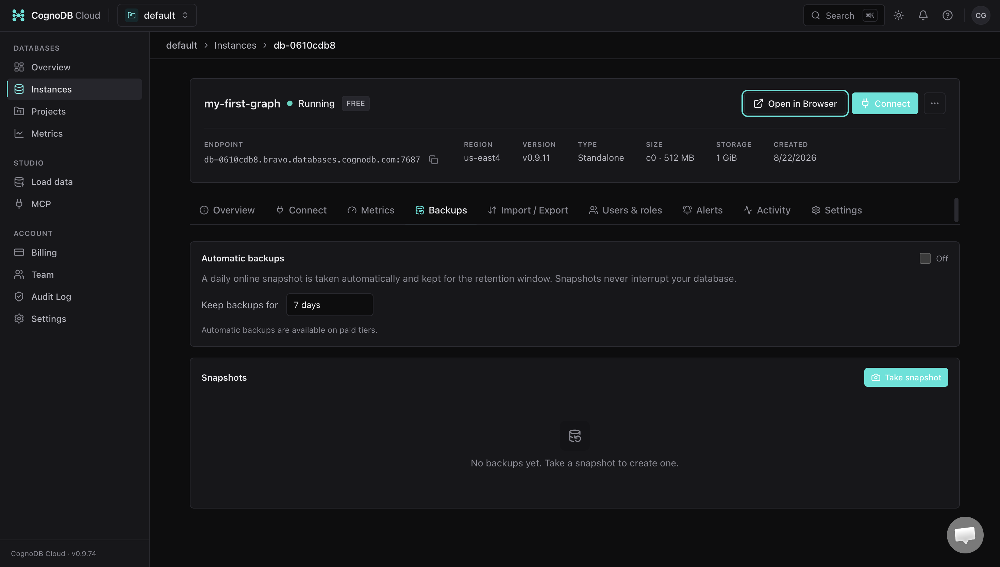
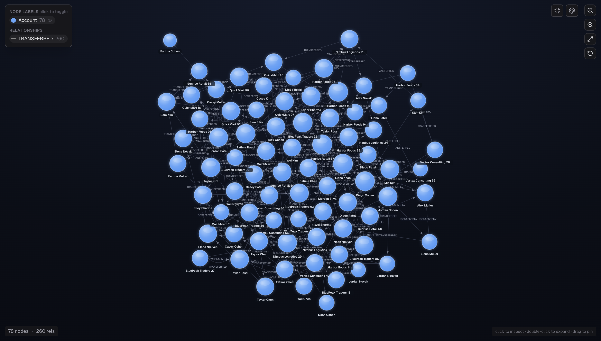
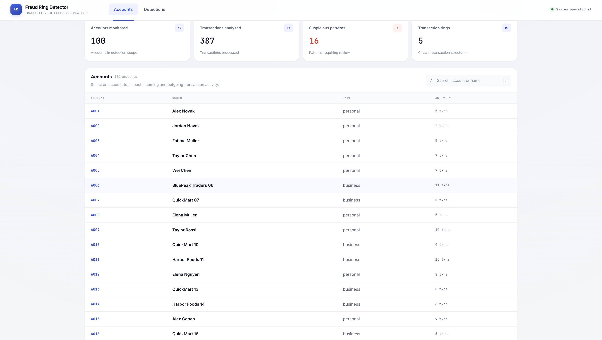
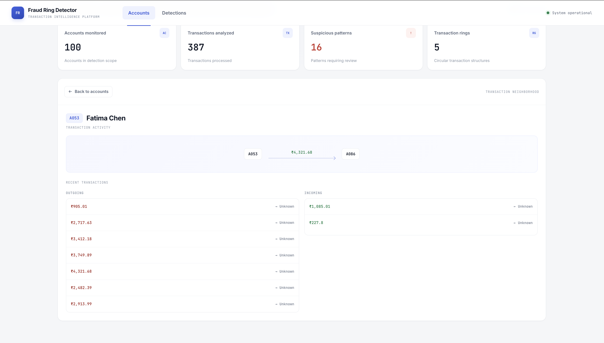
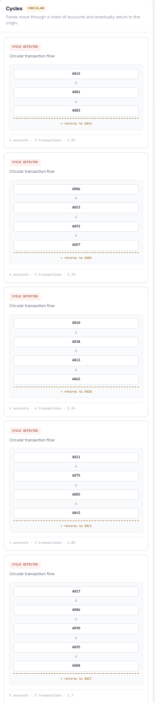
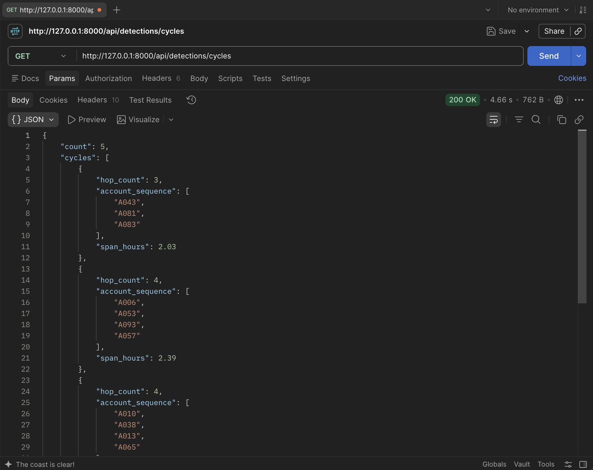

# Wexa_Ai-Assignment — Transaction Graph Anomaly Detector

A graph-based transaction anomaly detection application built with Django REST Framework, the Neo4j Python Driver, and CognoDB.

The application models financial accounts and money transfers as a graph and detects suspicious transaction structures such as multi-hop rings, fan-out patterns, and convergence patterns.

The project was designed to demonstrate a use case where the relationships between entities are more important than the attributes of individual records.

---

## Problem Statement

Financial transaction networks can contain suspicious behavior that is difficult to identify by examining transactions individually.

For example, consider the following transaction flow:

```
Account A
    │
    │ $500
    ▼
Account B
    │
    │ $480
    ▼
Account C
    │
    │ $450
    ▼
Account D
    │
    │ $430
    └──────────────► Account A
```

Individually, each transfer may look like a normal transaction. Together, however, they form a 4-hop circular flow.

This project detects these types of suspicious structures directly from the transaction graph.

The seed data deliberately contains:

- Normal one-off transactions acting as noise
- 3–6 hop transaction cycles ("rings")
- Fan-out patterns where one account distributes money to multiple accounts
- Convergence patterns where money from multiple accounts reaches a common account
- Combinations of fan-out and convergence behavior

The detection logic does not rely on a list of pre-planted suspicious accounts. Instead, the application discovers suspicious structures by traversing the graph.

---

## Why a Graph Database?

The suspicious behavior in this application is defined by transaction **topology** rather than by individual transaction attributes. Detecting a 4–6 hop circular flow requires traversing a variable-length path and checking whether it returns to the originating account. Similarly, identifying fan-out/convergence requires following relationships across multiple accounts.

These patterns are naturally represented and queried as graph traversals, whereas a relational implementation would require recursive CTEs or multiple self-joins whose complexity increases with traversal depth.

A relational schema could store the same accounts and transactions:

```
accounts
---------
id
name

transactions
------------
id
sender_id
receiver_id
amount
timestamp
```

However, detecting a 4–6 hop circular flow requires repeatedly following relationships:

```
A → B → C → D → A
```

In a relational implementation, this would typically require recursive CTEs or multiple self-joins. As the traversal depth and number of relationship patterns increase, those queries become harder to express and maintain.

In a graph database, the relationship is a first-class part of the data model:

```
(:Account)-[:TRANSFERRED]->(:Account)
```

This makes the core question natural: *can I follow a sequence of transfers for 3–6 hops and return to the originating account?*

The same applies to fan-out and convergence detection, where the application needs to follow relationships across multiple accounts.

**What the graph model gives this application:**

- Natural representation of account-to-account relationships
- Variable-length path traversal
- Multi-hop pattern matching
- Direct representation of transaction topology
- Cypher queries that closely resemble the business question
- Easier extension to additional relationship-based patterns

The graph database therefore earns its place because the structure of the network is itself the signal being detected.

---

## Architecture

```
                         Browser
                            │
                            │ HTTP
                            ▼
                  ┌─────────────────────┐
                  │     Django + DRF    │
                  │       REST API      │
                  └──────────┬──────────┘
                             │
                             ▼
                     detector/queries.py
                             │
                             ▼
                       detector/db.py
                             │
                             │ Neo4j Python Driver
                             ▼
                  ┌─────────────────────┐
                  │       CognoDB       │
                  │    Graph Database   │
                  └─────────────────────┘
```

The frontend communicates with the Django REST API. The backend contains the application logic and Cypher queries. Database access is kept in `detector/db.py`, rather than placing database code directly inside API views.

---

## Data Model

The core graph model is intentionally simple.

**Node — `Account`**

Represents a financial account.

Example properties:
- `id`
- `name`

**Relationship — `TRANSFERRED`**

Represents a transaction from one account to another.

Relationship properties:
- `amount`
- `timestamp`
- `transaction_id`

Therefore the fundamental graph structure is:

```cypher
(:Account)-[:TRANSFERRED {
    amount,
    timestamp,
    transaction_id
}]->(:Account)
```

This design treats the transfer itself as a relationship because the direction and connection between two accounts are essential to the anomaly-detection problem.

### Graph Model Diagram

The repository contains a visual graph-model diagram at:

```
docs/graph-model.png
```

The diagram documents Account nodes, TRANSFERRED relationships, transfer properties, and the direction of money movement.

---

## Seed Data

The seed script creates a reproducible synthetic transaction environment.

```
                    seed.py
                       │
          ┌────────────┼────────────┐
          ▼            ▼            ▼
       Accounts     Normal       Suspicious
                    transfers     patterns
                                   │
                    ┌──────────────┼──────────────┐
                    ▼              ▼              ▼
                  Rings         Fan-out       Convergence
```

The seed process:

1. Generates accounts
2. Generates normal transactions
3. Plants controlled suspicious structures
4. Writes the complete graph to CognoDB

The seed script does not perform fraud detection. Its purpose is to create deterministic test data that allows the detection algorithms to be evaluated against known patterns.

**Seeded dataset**

The intended dataset contains:

- 100 accounts
- 300 normal transactions
- 5 transaction rings
- 5 fan-out patterns
- 3 convergence patterns

> The final transaction count should be taken from the output of the final version of `seed.py`.

---

## Detection

The application currently detects three related graph patterns.

### 1. Cycle / Ring Detection

This is the primary multi-hop graph query. The goal is to identify flows such as:

```
A → B → C → D → A
A → B → C → D → E → F → A
```

The detector searches for cycles containing 3–6 transfers. Conceptually, the Cypher query needs to:

1. Start from an account.
2. Traverse outgoing `TRANSFERRED` relationships.
3. Allow a variable-length path.
4. Restrict the traversal to the required hop range.
5. Check whether the path returns to the originating account.
6. Return the accounts and transactions forming the suspicious ring.

The important part is that the detector discovers the pattern from the graph — it does not read a file containing the planted suspicious accounts.

### 2. Fan-Out Detection

A fan-out pattern occurs when one account rapidly distributes money to multiple accounts.

```
                 ┌──► B
                 │
                 ├──► C
        A ───────┼──► D
                 │
                 └──► E
```

The detector identifies accounts with multiple outgoing transaction relationships and evaluates the connected transaction structure. This is useful for identifying rapid distribution of funds across a network.

### 3. Convergence Detection

Convergence is the reverse structural pattern — multiple accounts send money toward a common account:

```
A ──────┐
        │
B ──────┼──► X
        │
C ──────┘
```

This can be especially interesting when it follows a fan-out:

```
             ┌──► B ──┐
             │         │
             ├──► C ───┼──► X
             │         │
A ───────────└──► D ──┘
```

The application exposes fan-out/convergence results through the detection API so the frontend can display related suspicious structures.

---

## Main Cypher Queries

The Cypher queries are stored separately from the API views:

```
backend/detector/queries.py
```

This keeps the architecture separated into:

```
API View → Detection Function → Cypher Query → Database Driver → CognoDB
```

**Parameterized queries**

Queries are executed through the official Neo4j Python driver and use parameters rather than constructing Cypher strings from user input. This keeps database access safer and makes the query functions reusable.

---

## API

The backend is implemented using Django + Django REST Framework (DRF).

| Endpoint | Purpose |
|---|---|
| `GET /api/health` | Verify CognoDB connectivity |
| `GET /api/accounts` | List/search accounts |
| `GET /api/accounts/{id}` | Retrieve account details |
| `GET /api/accounts/{id}/transactions` | Retrieve an account's transaction neighborhood |
| `GET /api/detections/cycles` | Detect suspicious transaction rings |
| `GET /api/detections/fanout` | Detect fan-out/convergence patterns |

**Error handling**

| Status | Meaning |
|---|---|
| `200 OK` | Successful request |
| `404 Not Found` | Requested account does not exist |
| `503 Service Unavailable` | CognoDB is unavailable or the backend cannot establish a database connection |

---

## Frontend

The frontend is implemented using HTML, CSS, and JavaScript. The interface provides:

**Account discovery** — Users can search/list accounts and select an account.

**Transaction graph** — Selecting an account displays its transaction neighborhood:

```
              Account B
                  ▲
                  │
                  │
Account C ◄──── Account A ────► Account D
                  │
                  ▼
              Account E
```

**Suspicious patterns** — Accounts involved in detected patterns are highlighted, e.g.:

```
Account A
  HIGH RISK
  Part of a 4-hop transaction ring
```

The UI also handles:

- Loading state while detection queries execute
- Empty state when no suspicious patterns are found
- Error state when CognoDB/backend services are unavailable

---

## Project Structure

```
transaction-graph/
│
├── backend/
│   ├── manage.py
│   │
│   ├── config/
│   │
│   └── detector/
│       ├── views.py
│       ├── urls.py
│       ├── db.py
│       └── queries.py
│
├── scripts/
│   └── seed.py
│
├── frontend/
│   ├── index.html
│   ├── app.js
│   └── styles.css
│
├── docs/
│   └── graph-model.png
│
├── .env.example
├── .gitignore
├── requirements.txt
└── README.md
```

---

## Technology Stack

| Layer | Technology |
|---|---|
| Frontend | HTML, CSS, JavaScript |
| Backend | Python |
| Web framework | Django |
| API framework | Django REST Framework |
| Database | CognoDB |
| Database protocol | Bolt |
| Database driver | Official Neo4j Python Driver |
| Query language | Cypher |
| Deployment | Render + CognoDB |

---

## Setup

### Prerequisites

Install:

- Python 3
- pip
- Git
- A CognoDB account
- A CognoDB graph instance

### 1. Create a CognoDB Instance

Create a graph database instance through CognoDB. After the instance is running, obtain the connection details: endpoint, username, and password.

The application uses the Neo4j-compatible Bolt interface exposed by CognoDB.

> Do not commit database credentials to GitHub.

### 2. Clone the Repository

```bash
git clone <repository-url>
cd transaction-graph
```

### 3. Install Backend Dependencies

```bash
pip install -r requirements.txt
```

### 4. Configure Environment Variables

Create `.env` from `.env.example`.

```
COGNODB_URI=bolt+s://<your-cognodb-endpoint>:7687
COGNODB_USERNAME=<your-username>
COGNODB_PASSWORD=<your-password>
```

> The actual password must never be committed to the repository.

### 5. Seed the Database

```bash
python scripts/seed.py
```

The script generates the accounts and transaction graph, including the controlled suspicious patterns.

### 6. Start the Backend

From the backend directory:

```bash
python manage.py runserver
```

The API will be available at the local Django development address, e.g. `http://127.0.0.1:8000`.

### 7. Start the Frontend

Open the frontend using the configured development server or static HTTP server. For example:

```bash
cd frontend
python -m http.server 5500
```

Then open `http://127.0.0.1:5500`.

The frontend communicates with the Django API.

---

## Testing

The graph functionality was tested independently before exposing it through the API.

```
test_connection.py       → Can Python connect to CognoDB?
test_schema.py           → Is the graph structured correctly?
test_cycles.py           → Does cycle detection identify the known rings?
test_fanout.py           → Does fan-out detection work?
test_convergence.py      → Does convergence detection work?
API tests                → Can external clients access the detections?
```

The detection results were verified against the known seeded ground truth.

---

## Example Suspicious Ring

A detected ring may look conceptually like:

```
                    HIGH RISK
                        │
                        ▼
                  ┌───────────┐
                  │ Account A │
                  └─────┬─────┘
                        │
                    TRANSFERRED
                        │
                        ▼
                  ┌───────────┐
                  │ Account B │
                  └─────┬─────┘
                        │
                    TRANSFERRED
                        │
                        ▼
                  ┌───────────┐
                  │ Account C │
                  └─────┬─────┘
                        │
                    TRANSFERRED
                        │
                        ▼
                  ┌───────────┐
                  │ Account D │
                  └─────┬─────┘
                        │
                    TRANSFERRED
                        │
                        └────────────► Account A
```

The UI can describe this as:

> **Suspicious Pattern:** 4-hop transaction ring
> Account A → Account B → Account C → Account D → Account A

---

## Screenshots

The repository should contain screenshots demonstrating the working application.

Recommended screenshots:

1. **CognoDB Instance** — the running database instance and connection configuration, with credentials hidden
2. **Graph Model** — the graph-model diagram
3. **Account Explorer** — the account search/list interface
4. **Transaction Graph** — an account with its transaction neighborhood
5. **Suspicious Ring** — a detected 4–6 hop ring with the suspicious accounts highlighted
6. **Fan-Out / Convergence** — a detected fan-out or convergence structure

```
docs/
├── graph-model.png
├── cognodb-instance.png
├── account-explorer.png
├── transaction-graph.png
├── suspicious-ring.png
└── fanout-convergence.png
```

---

## Hosted Demo

**Live Application:** `<ADD RENDER DEPLOYMENT URL>`

**Screen Recording:** `<ADD SCREEN RECORDING URL>`

A short screen recording demonstrates:

1. Opening the application
2. Searching/selecting an account
3. Viewing its transaction graph
4. Running/viewing suspicious-pattern detection
5. Displaying a detected transaction ring
6. Showing the relationship between the UI result and the underlying graph structure

---

## Deployment

The application is hosted on Render with CognoDB providing the graph database.

```
                       Internet
                           │
                           ▼
                    ┌─────────────┐
                    │    Render   │
                    │             │
                    │ Django/DRF  │
                    └──────┬──────┘
                           │
                           │ Neo4j Driver
                           ▼
                    ┌─────────────┐
                    │   CognoDB   │
                    │             │
                    │ Transaction │
                    │    Graph    │
                    └─────────────┘
```

Environment variables containing database credentials are configured through the hosting platform rather than committed to the repository.

---

## Limitations

This project intentionally focuses on graph-structural detection rather than production-grade fraud scoring. The synthetic dataset is relatively small and designed for demonstrating graph traversal.

The current implementation does not attempt to solve:

- Large-scale model training
- Real-time production fraud scoring
- Customer identity verification
- Regulatory compliance
- Production transaction ingestion
- Distributed graph processing

The goal is to demonstrate how graph-native reasoning can identify suspicious transaction structures.

---

## Future Work: Graph Machine Learning

At larger scale, a natural next step would be moving beyond manually specified structural rules toward graph machine learning.

One possible approach is **GraphSAGE**, which can learn node representations by aggregating information from neighboring nodes. The transaction graph could provide features such as:

- Transaction amounts
- Transaction frequency
- Time information
- Neighboring account behavior
- Local graph structure
- Historical anomaly labels

A model could then learn representations of accounts and identify accounts whose graph context resembles known suspicious behavior. The **Elliptic Bitcoin Transaction Dataset** is a useful example of this direction — it demonstrates how graph-based machine learning can be applied to transaction networks.

This is intentionally future work rather than part of the current implementation. For a one-day implementation, deterministic Cypher-based graph pattern detection provides a transparent and explainable baseline.

---

## Why This Approach?

The important distinction in this project is:

**Traditional attribute-based detection**
```
Transaction
├── amount
├── timestamp
└── account information
```

**Graph-based detection**
```
Account
   │
   ├──► Account
   │       │
   │       └──► Account
   │               │
   │               └────────► Account
   │
   └──► multiple connected accounts
```

The suspicious signal can exist in the relationship structure even when individual transactions appear ordinary. That makes graph traversal a natural fit for the problem.

---

## Assignment Requirement Mapping

| Wexa Requirement | Implementation |
|---|---|
| Graph data model | `(:Account)-[:TRANSFERRED]->(:Account)` |
| Labeled nodes | `Account` |
| Typed relationships | `TRANSFERRED` |
| Relationship properties | `amount`, `timestamp`, `transaction_id` |
| Seed data | Synthetic transaction generator |
| Multi-hop query | 3–6 hop cycle detection |
| Relationally awkward query | Cycle, fan-out and convergence traversal |
| Parameterized Cypher | Neo4j Python Driver |
| Functional UI | Account and suspicious-pattern explorer |
| Loading state | Detection query loading state |
| Empty state | No suspicious patterns |
| Error state | CognoDB/backend unavailable |
| Hosted demo | Render |
| Database | CognoDB |
| README diagram | Account/transaction graph |
| Screen recording | Suspicious transaction-ring demonstration |
| Advanced next step | GraphSAGE / Elliptic discussion |

---

## Project Status

The backend and graph-analysis components have been implemented and verified against the seeded transaction graph.

**Implemented:**

- CognoDB connectivity
- Account and transaction graph
- Synthetic seed data
- Cycle/ring detection
- Fan-out detection
- Convergence detection
- Django REST API
- Account APIs
- Transaction-neighborhood API
- Database error handling
- Frontend integration

**Remaining submission artifacts to finalize before submission:**

- Final screenshots
- Render hosted URL
- Screen recording URL
- Exact final seed-data counts
- Repository URL
- Any deployment-specific setup commands

---


### CognoDB Running Instance



### Graph Data



### Account Explorer



### Transaction Detail



### Cycle Detection



### API Evidence



## Author

**Arnav**
Computer Science Student